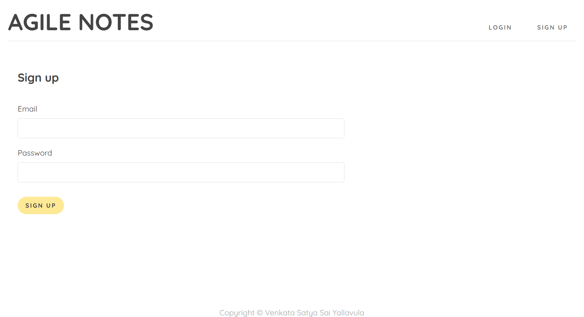
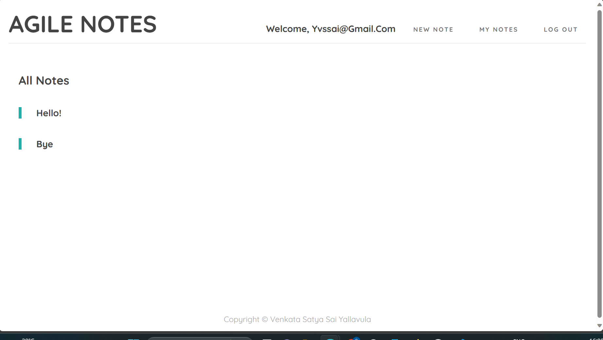
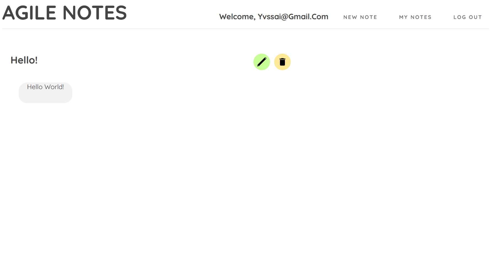

# Agile Notes

Agile Notes is a simple web application for taking and managing notes. It is built using Node.js, Express.js, and MongoDB.

Check These Working ScreenShots of the project






## Table of Contents

- [Features](#features)
- [Prerequisites](#prerequisites)
- [Getting Started](#getting-started)
- [Project Structure](#project-structure)
- [Contributing](#contributing)
- [License](#license)

## Features

- User authentication (signup, login, logout)
- Create, update, and delete notes
- View a list of all notes
- View detailed information about a specific note
- Validation of user inputs
- Secure authentication using JWT (JSON Web Tokens)
- MongoDB database for data storage

## Prerequisites

Before you begin, ensure you have met the following requirements:

- Node.js: Make sure Node.js is installed on your system.
- MongoDB: Install and configure MongoDB as your database. You can use [MongoDB Community Edition](https://www.mongodb.com/try/download/community) or a cloud-based MongoDB service.

## Getting Started

1. **Clone the repository:**

```bash
   git clone https://github.com/your-username/agile-notes.git 
 ```

2. **Install Dependencies**
 ```bash
    npm install
 ```
3. **Set .env File**
